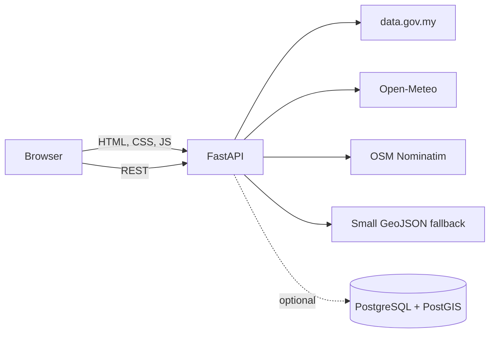

# Architecture

## Runtime shape

The existing FastAPI app remains the single deployable service. It serves the framework-free frontend and protects external providers behind validated proxy routes. The browser never receives a database connection string or API secret.

## Main components

- `frontend/`: accessible HTML, compact CSS system, MapLibre GL JS map, Chart.js chart and vanilla JavaScript state.
- `api/`: thin HTTP routes for weather, warnings, search, layers and proximity.
- `services/`: bounded external clients plus the deterministic spatial fallback.
- `data/sample/`: small WGS84 portfolio layers with source/licence metadata.
- `database/`: PostGIS extension, geometry table, GiST index and idempotent seed.
- `scripts/`: fetch, validate, transform and parameterized PostGIS load steps.

## Spatial modes

1. **Demo fallback (default):** dependency-free distance calculations over small, clearly labelled GeoJSON. It guarantees the portfolio can run at RM0 without a database.
2. **PostGIS-ready:** Compose starts PostgreSQL/PostGIS and the load script imports the same GeoJSON. Promoting the API query to `ST_DWithin` is intentionally left as a documented next step; the live MVP does not pretend to use the database when it does not.

## Frontend limits

Five overlays, three user-requested basemaps, four KPI cards and one chart. Satellite and Hybrid use Esri imagery/reference services; OpenStreetMap supplies the street basemap. The selected location drives weather and analysis; there is no paid or generative AI dependency.
